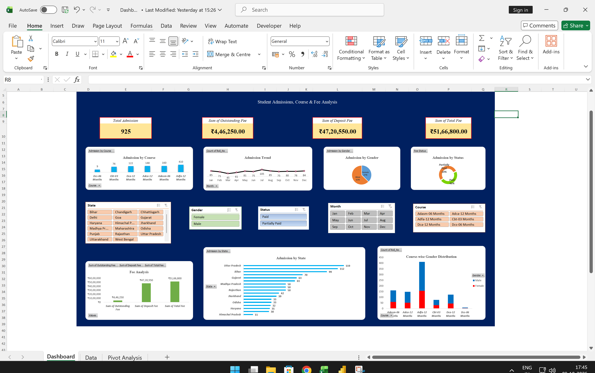
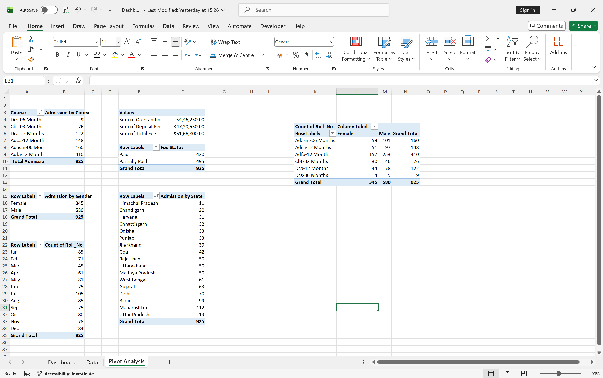

# 📊 Student Admissions & Financial Dashboard

## 📌 Executive Summary
This interactive Excel analytics dashboard provides an end-to-end operational overview of student enrollments, fee collection performance, outstanding dues, and course-wise demographic distribution across **925 student admissions**. Built entirely in Microsoft Excel using linked **Pivot Tables**, **Pivot Charts**, and synchronized **Slicers**, it enables dynamic filtering by course, state, fee payment status, and month.

### 1. 🖥️ Interactive Dashboard Overview

### 2. Underlying Pivot Analysis & Aggregations

## ⚙️ Project Architecture & Workflow

1. **`Data` Sheet:** Cleaned 925-row structured dataset containing enrollment records, financial transactions, payment statuses, and geographical details.
2. **`Pivot Analysis` Sheet:** Staging area containing aggregated Pivot Tables for intake trends, revenue sums, state-wise rankings, and gender cross-tabulations.
3. **`Dashboard` Sheet:** Presentation layout housing KPI cards, dynamic Pivot Charts, and interactive Slicers.

